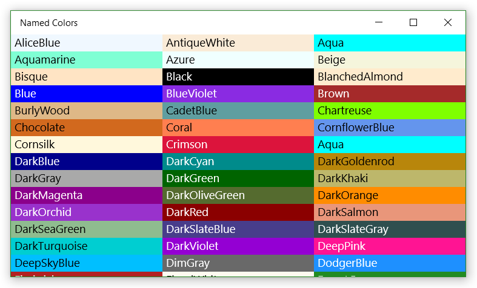

<!---
  category: GraphicsAndAnimation
  language: cs
-->

# Get the name and contrasting foreground of a color 

Provides extension methods for the Color structure. 

GetName gets the name of the color from the corresponding property of the Colors class, or null if there is no corresponding property. 

GetContrastingForegroundColor gets an appropriate foreground color (either black or white) to produce legible text when 
using the color as a background. (See screenshot below.)

```C#
using System;
using System.Collections.Generic;
using System.Linq;
using System.Reflection;
using Windows.UI;

public static class ColorExtensions
{
    public static string GetName(this Color color) =>
        ColorNameTuples
        .Where(c => c.Item1.Equals(color))
        .Select(c => c.Item2).FirstOrDefault();

    public static Color GetContrastingForegroundColor(this Color c) =>
        c.R * 0.3 + c.G * 0.59 + c.B * 0.11 > 127 ? Colors.Black : Colors.White;

    private static List<Tuple<Color, string>> ColorNameTuples =>
        typeof(Colors).GetRuntimeProperties()
        .Select(p => Tuple.Create((Color)p.GetValue(null), p.Name))
        .ToList();
}
```

## Usage

This example uses the GetName and GetContrastingForegroundColor extension methods to populate 
a collection of NamedColor data objects for display in a GridView.   

```C#
List<NamedColor> NamedColors { get; } =
    (from property in typeof(Colors).GetRuntimeProperties()
     let color = (Color)property.GetValue(null)
     select new NamedColor
     {
         Brush = new SolidColorBrush(color),
         Name = color.GetName(),
         ForegroundBrush = new SolidColorBrush(color.GetContrastingForegroundColor())
     })
    .ToList();
```

  

## See also

[Color structure](https://msdn.microsoft.com/library/windows/apps/windows.ui.color.aspx)  
[Colors class](https://msdn.microsoft.com/library/windows/apps/windows.ui.colors.aspx)  
[GetRuntimeProperties extension method](https://msdn.microsoft.com/library/system.reflection.runtimereflectionextensions.getruntimeproperties.aspx)  
[Lambda expressions](https://msdn.microsoft.com/library/bb397687.aspx) (anonymous methods using the "=>" syntax)  
[Expression-bodied function members](http://blogs.msdn.com/b/csharpfaq/archive/2014/11/20/new-features-in-c-6.aspx) (methods and properties with the "=>" syntax)  

[Item containers and templates](https://docs.microsoft.com/windows/uwp/controls-and-patterns/listview-item-templates) uses similar code to demonstrate item template creation.  
